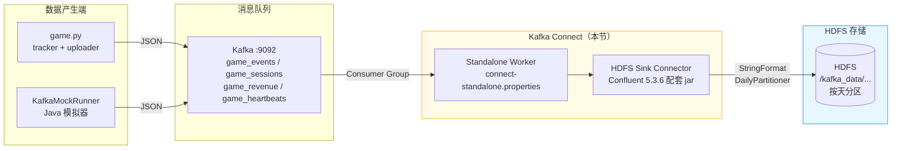
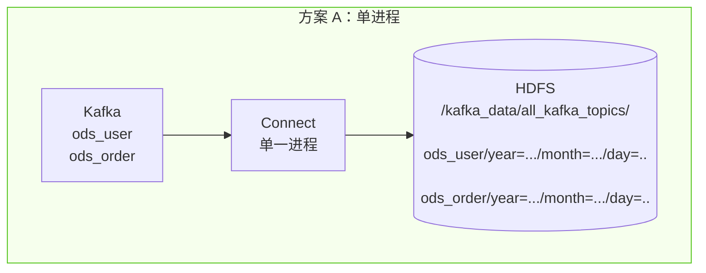
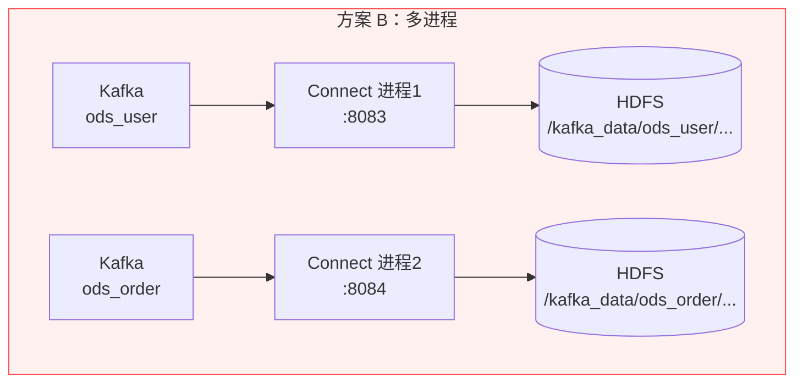

> **环境**：Kafka 2.11-2.1.0 · Hadoop 2.7.6 · Confluent 5.3.6 · JDK 1.8
>
> **目标**：将 Kafka Topic 中的数据通过 Kafka Connect Standalone 模式，实时写入 HDFS，供 MapReduce 离线分析。

---

## 一、整体数据流



---

## 二、前置条件

### 2.1 Kafka 集群正常运行

创建业务 Topic（如 ods_user、ods_order，本项目为 game_events 等）：

```bash
# 创建 topic
bin/kafka-topics.sh --create \
    --topic ods_user \
    --partitions 2 \
    --replication-factor 1 \
    --zookeeper zk1:2181

# 测试生产消息
bin/kafka-console-producer.sh --broker-list kafka1:9092 --topic ods_user
{"id":1,"name":"zhangsan"}
```

### 2.2 Hadoop 连通性验证

在运行 Connect 的机器上：

1. 配置 `/etc/hosts`，确保能解析所有 NameNode / DataNode 主机名
2. 验证 HDFS 读写：

```bash
hadoop fs -mkdir /tmp/kafka_test
hadoop fs -rm -r /tmp/kafka_test
```

3. **拷贝 Hadoop 核心配置到 Kafka 目录**（解决 `No FileSystem for hdfs://`）：

```bash
cd $KAFKA_HOME
mkdir -p config/hadoop
# 从 Hadoop 节点复制配置文件（替换实际路径）
scp hadoop@nn1:/opt/hadoop-2.7.6/etc/hadoop/{core-site.xml,hdfs-site.xml} config/hadoop/
```

### 2.3 目录规划

```
$KAFKA_HOME/
├── plugins/
│   └── hdfs-sink/          ← Confluent hdfs 连接器所有 jar
├── config/
│   ├── hadoop/             ← core-site.xml, hdfs-site.xml
│   ├── connect-standalone.properties   ← worker 基础配置
│   └── hdfs-sink-multi.properties      ← hdfs sink 连接器配置
└── logs/connect/           ← connect 日志目录
```

---

## 三、安装 HDFS Sink 连接器

### 3.1 下载 Confluent 5.3.6 完整包

> ⚠️ **不要单独下载 zip 包**，地址已失效（报 NoSuchKey）；必须下载完整 tar.gz 后提取。

```bash
# 下载（约 500 MB）
wget https://packages.confluent.io/archive/5.3/confluent-5.3.6-2.11.tar.gz

# 解压
tar -zxvf confluent-5.3.6-2.11.tar.gz
```

### 3.2 复制连接器 jar 到 Kafka 插件目录

```bash
mkdir -p $KAFKA_HOME/plugins/hdfs-sink

# 拷贝全部依赖 jar（含 hdfs connector + 依赖）
cp -r confluent-5.3.6-2.11/share/java/kafka-connect-hdfs/* \
       $KAFKA_HOME/plugins/hdfs-sink/
```

### 3.3 解决 Guava / Protobuf 版本冲突（必做）

Confluent 自带高版本 guava，与 Hadoop 2.7.6 不兼容，需要手动替换：

```bash
cd $KAFKA_HOME/plugins/hdfs-sink

# 删除高版本
rm -f guava-*.jar protobuf-java-*.jar

# 替换为 Hadoop 2.7.6 原生版本
cp /opt/hadoop-2.7.6/share/hadoop/common/lib/guava-11.0.2.jar ./
cp /opt/hadoop-2.7.6/share/hadoop/common/lib/protobuf-java-2.5.0.jar ./
```

---

## 四、Worker 基础配置

编辑 `$KAFKA_HOME/config/connect-standalone.properties`：

```properties
# Kafka 集群地址，替换为实际 broker
bootstrap.servers=kafka1:9092,kafka2:9092

# 插件目录
plugin.path=/opt/kafka_2.11-2.1.0/plugins

# JSON 序列化（无 schema 业务数据）
key.converter=org.apache.kafka.connect.json.JsonConverter
value.converter=org.apache.kafka.connect.json.JsonConverter
key.converter.schemas.enable=false
value.converter.schemas.enable=false

# Standalone 本地 offset 存储（多进程时每个进程必须改为不同文件）
offset.storage.file.filename=/tmp/connect-hdfs-offsets
offset.flush.interval.ms=10000

# REST 管理端口（多进程时依次改为 8083/8084/8085...）
rest.port=8083
```

---

## 五、两种多 Topic 落 HDFS 方案

### 方案 A：单进程多 Topic（简单，同一根目录下按 Topic 分子目录）



**配置文件** `config/hdfs-sink-multi.properties`：

```properties
# 连接器名称
name=hdfs-sink-multi-topic
connector.class=io.confluent.connect.hdfs.HdfsSinkConnector
# 并发任务数 ≤ 所有 topic 分区总数之和
tasks.max=4

# 多 topic 逗号分隔
topics=ods_user,ods_order

# HDFS 地址（HA 写 nameservice，单 NN 写 hdfs://nn1:8020）
hdfs.url=hdfs://mycluster
hadoop.conf.dir=/opt/kafka_2.11-2.1.0/config/hadoop

# 全局根目录，连接器自动在下面创建 topic 子目录
topics.dir=/kafka_data/all_kafka_topics

# 每 10000 条或每 30 分钟刷写一次（优化小文件）
flush.size=10000
rotate.interval.ms=1800000
rotate.schedule.interval.ms=300000

# 存储格式：纯 JSON 字符串
format.class=io.confluent.connect.hdfs.string.StringFormat
# 按天分区
partitioner.class=io.confluent.connect.hdfs.partitioner.DailyPartitioner
timezone=Asia/Shanghai
locale=en
```

**落地目录结构**：

```
/kafka_data/all_kafka_topics/
  ods_user/year=2026/month=06/day=29/partition=0/xxx.log
  ods_order/year=2026/month=06/day=29/partition=0/xxx.log
```

---

### 方案 B：多进程分 Topic（隔离性强，推荐生产）



**进程 1 Worker 配置** `config/connect-standalone-user.properties`：

```properties
bootstrap.servers=kafka1:9092,kafka2:9092
plugin.path=/opt/kafka_2.11-2.1.0/plugins
key.converter=org.apache.kafka.connect.json.JsonConverter
value.converter=org.apache.kafka.connect.json.JsonConverter
key.converter.schemas.enable=false
value.converter.schemas.enable=false
# 独立 offset 文件
offset.storage.file.filename=/tmp/connect-offsets-user
offset.flush.interval.ms=10000
rest.port=8083
```

**进程 1 Sink 配置** `config/hdfs-sink-user.properties`：

```properties
name=hdfs-sink-user
connector.class=io.confluent.connect.hdfs.HdfsSinkConnector
tasks.max=2
topics=ods_user
# 独立顶层目录
topics.dir=/kafka_data/ods_user
hdfs.url=hdfs://mycluster
hadoop.conf.dir=/opt/kafka_2.11-2.1.0/config/hadoop
flush.size=10000
rotate.interval.ms=1800000
format.class=io.confluent.connect.hdfs.string.StringFormat
partitioner.class=io.confluent.connect.hdfs.partitioner.DailyPartitioner
timezone=Asia/Shanghai
```

**进程 2 Worker 配置** `config/connect-standalone-order.properties`：

```properties
bootstrap.servers=kafka1:9092,kafka2:9092
plugin.path=/opt/kafka_2.11-2.1.0/plugins
key.converter=org.apache.kafka.connect.json.JsonConverter
value.converter=org.apache.kafka.connect.json.JsonConverter
key.converter.schemas.enable=false
value.converter.schemas.enable=false
offset.storage.file.filename=/tmp/connect-offsets-order
offset.flush.interval.ms=10000
# ⚠️ 端口必须与进程1不同
rest.port=8084
```

**进程 2 Sink 配置** `config/hdfs-sink-order.properties`：

```properties
name=hdfs-sink-order
connector.class=io.confluent.connect.hdfs.HdfsSinkConnector
tasks.max=2
topics=ods_order
topics.dir=/kafka_data/ods_order
hdfs.url=hdfs://mycluster
hadoop.conf.dir=/opt/kafka_2.11-2.1.0/config/hadoop
flush.size=10000
rotate.interval.ms=1800000
format.class=io.confluent.connect.hdfs.string.StringFormat
partitioner.class=io.confluent.connect.hdfs.partitioner.DailyPartitioner
timezone=Asia/Shanghai
```

**落地目录结构**（完全隔离）：

```
/kafka_data/ods_user/year=2026/month=06/day=29/xxx.log
/kafka_data/ods_order/year=2026/month=06/day=29/xxx.log
```

---

## 六、启动 Connect Standalone

### 方案 A — 单进程多 Topic

```bash
cd $KAFKA_HOME
mkdir -p logs/connect

nohup bin/connect-standalone.sh \
    config/connect-standalone.properties \
    config/hdfs-sink-multi.properties \
    > logs/connect/hdfs-multi.log 2>&1 &

# 实时查看日志
tail -f logs/connect/hdfs-multi.log
```

### 方案 B — 多进程分 Topic

```bash
cd $KAFKA_HOME
mkdir -p logs/connect

# 进程 1：ods_user
nohup bin/connect-standalone.sh \
    config/connect-standalone-user.properties \
    config/hdfs-sink-user.properties \
    > logs/connect/user.log 2>&1 &

# 进程 2：ods_order
nohup bin/connect-standalone.sh \
    config/connect-standalone-order.properties \
    config/hdfs-sink-order.properties \
    > logs/connect/order.log 2>&1 &
```

---

## 七、验证与检查

### 7.1 验证插件加载成功

```bash
curl http://127.0.0.1:8083/connector-plugins | grep HdfsSinkConnector
# 返回包含 io.confluent.connect.hdfs.HdfsSinkConnector 即正常
```

### 7.2 查看连接器运行状态

```bash
# 查看所有连接器
curl http://127.0.0.1:8083/connectors

# 查看指定连接器状态（应为 RUNNING）
curl http://127.0.0.1:8083/connectors/hdfs-sink-multi-topic/status
```

### 7.3 验证 HDFS 落地数据

> ⚠️ 数据达到 `flush.size=10000` 或触发 `rotate.interval.ms` 后才会写入 HDFS，测试时可先把 flush.size 改为 10。

```bash
# 方案 A 查看
hadoop fs -ls /kafka_data/all_kafka_topics/ods_user
hadoop fs -cat /kafka_data/all_kafka_topics/ods_user/year=2026/month=06/day=29/partition=0/*.log

# 方案 B 查看
hadoop fs -ls /kafka_data/ods_order
```

---

## 八、常见报错与解决方案

| 报错信息 | 原因 | 解决方案 |
|---------|------|---------|
| `ClassNotFound: HdfsSinkConnector` | `plugin.path` 路径写错，或 jar 层级嵌套 | jar 必须直接放在 `hdfs-sink/` 下，不能再嵌套子目录 |
| `No FileSystem for scheme hdfs://` | 未配置 `hadoop.conf.dir`，或 core-site.xml 缺失 | 检查 `hadoop.conf.dir` 指向，确保两个 xml 文件存在 |
| `Guava NoSuchMethodError` | 插件目录自带高版本 guava 与 Hadoop 2.7.6 冲突 | 删除插件目录中的 guava-*.jar，替换为 `guava-11.0.2.jar` |
| `Address already in use` | 多进程 `rest.port` 端口冲突 | 各进程端口改为 8083 / 8084 / 8085 依次错开 |
| `HDFS Permission denied` | Connect 启动用户无写入权限 | `hadoop fs -chmod -R 777 /kafka_data` |
| 大量小文件 | `flush.size` 太小，写入频繁 | 调大 `flush.size`，开启 `rotate.schedule.interval.ms` 定时轮转 |

---

## 知识点小结

| 知识点 | 说明 |
|--------|------|
| Kafka Connect 定位 | 官方集成框架，无需自己写消费者代码，配置文件驱动数据流转 |
| Standalone vs Distributed | Standalone 适合单机开发/小规模，Distributed 适合生产集群高可用 |
| StringFormat | 将 Kafka 消息原样以 JSON 字符串写入 HDFS，不做格式转换，MapReduce 直接解析 |
| DailyPartitioner | 按 `year=.../month=.../day=...` 自动分目录，天然适合 MapReduce 按日期扫描 |
| flush.size 调优 | 太小→小文件问题；太大→延迟高。生产建议 10000~100000 加 rotate 兜底 |
| Guava 版本固定 | Hadoop 2.7.x 强依赖 guava-11，升级会导致方法签名不兼容 |
