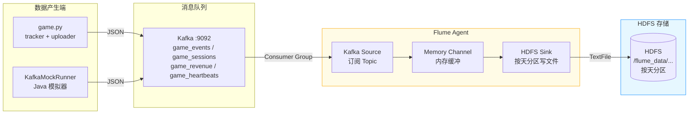
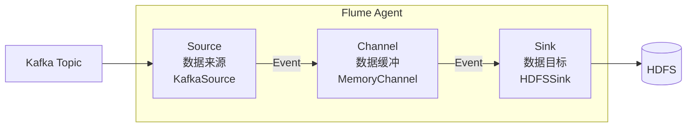

> **环境**：Kafka 2.11-2.1.0 · Hadoop 2.7.6 · Flume 1.9.0 · JDK 1.8
>
> **目标**：利用 Apache Flume 的 Kafka Source + HDFS Sink，将 Kafka Topic 中的游戏埋点数据实时写入 HDFS，供 MapReduce 离线分析使用。

---

## 一、整体数据流



---

## 二、前置条件

### 2.1 安装 Flume 1.9.0

```bash
# 下载
wget https://archive.apache.org/dist/flume/1.9.0/apache-flume-1.9.0-bin.tar.gz

# 解压到 /opt
tar -zxvf apache-flume-1.9.0-bin.tar.gz -C /opt
ln -s /opt/apache-flume-1.9.0-bin /opt/flume

# 配置环境变量（追加到 ~/.bashrc）
echo 'export FLUME_HOME=/opt/flume' >> ~/.bashrc
echo 'export PATH=$PATH:$FLUME_HOME/bin' >> ~/.bashrc
source ~/.bashrc

# 验证
flume-ng version
```

### 2.2 配置 JAVA_HOME

编辑 `$FLUME_HOME/conf/flume-env.sh`：

```bash
cp $FLUME_HOME/conf/flume-env.sh.template $FLUME_HOME/conf/flume-env.sh

# 追加 JAVA_HOME（替换实际路径）
echo 'export JAVA_HOME=/usr/lib/jvm/java-8-openjdk-amd64' >> $FLUME_HOME/conf/flume-env.sh
```

### 2.3 添加 Hadoop 客户端 jar（解决 HDFS 写入依赖）

```bash
# 将 Hadoop 客户端核心 jar 复制到 Flume lib 目录
cp /opt/hadoop-2.7.6/share/hadoop/common/*.jar               $FLUME_HOME/lib/
cp /opt/hadoop-2.7.6/share/hadoop/common/lib/*.jar           $FLUME_HOME/lib/
cp /opt/hadoop-2.7.6/share/hadoop/hdfs/*.jar                 $FLUME_HOME/lib/
cp /opt/hadoop-2.7.6/share/hadoop/hdfs/lib/*.jar             $FLUME_HOME/lib/
cp /opt/hadoop-2.7.6/etc/hadoop/core-site.xml                $FLUME_HOME/conf/
cp /opt/hadoop-2.7.6/etc/hadoop/hdfs-site.xml                $FLUME_HOME/conf/
```

> ⚠️ **Guava 版本冲突**：如报 `NoSuchMethodError guava`，执行：
>
> ```bash
> # 删除 Flume 自带高版本 guava
> rm -f $FLUME_HOME/lib/guava-*.jar
> # 换入 Hadoop 2.7.6 匹配版本
> cp /opt/hadoop-2.7.6/share/hadoop/common/lib/guava-11.0.2.jar $FLUME_HOME/lib/
> ```

### 2.4 添加 Kafka 客户端 jar

Flume 1.9 自带的 kafka-clients 版本较旧，需替换为与 kafka_2.11-2.1.0 匹配的版本：

```bash
# 删除旧版
rm -f $FLUME_HOME/lib/kafka-clients-*.jar

# 从 Kafka 安装目录复制
cp /opt/kafka_2.11-2.1.0/libs/kafka-clients-2.1.0.jar $FLUME_HOME/lib/
```

### 2.5 目录规划

```
$FLUME_HOME/
├── conf/
│   ├── flume-env.sh          ← JAVA_HOME 配置
│   ├── core-site.xml         ← 从 Hadoop 复制
│   ├── hdfs-site.xml         ← 从 Hadoop 复制
│   ├── game-events.conf      ← game_events topic Agent 配置
│   ├── game-sessions.conf    ← game_sessions topic Agent 配置
│   └── game-all.conf         ← 多 topic 单 Agent 配置（可选）
└── logs/                     ← Flume 运行日志
```

---

## 三、Flume Agent 配置文件

### 3.1 核心概念



| 组件 | 职责 | 本项目选型 |
|------|------|---------|
| **Source** | 从外部拉取/接收数据 | `KafkaSource`（消费 Kafka Topic） |
| **Channel** | 在 Source 和 Sink 间缓冲 Event | `MemoryChannel`（内存，高吞吐） |
| **Sink** | 将 Event 写出到目标系统 | `HDFSSink`（写 HDFS，按天分区） |

### 3.2 方案 A：每个 Topic 独立 Agent（隔离性强）

**`conf/game-events.conf`** — 处理 `game_events` Topic：

```properties
# ========== Agent 声明 ==========
# Agent 名称为 a1，组件命名：sources/channels/sinks
a1.sources  = kafkaSrc
a1.channels = memChannel
a1.sinks    = hdfsSink

# ========== Source：从 Kafka 消费 ==========
a1.sources.kafkaSrc.type = org.apache.flume.source.kafka.KafkaSource

# Kafka Broker 地址
a1.sources.kafkaSrc.kafka.bootstrap.servers = 172.30.206.104:9092

# 订阅的 Topic
a1.sources.kafkaSrc.kafka.topics = game_events

# Consumer Group（同一应用保持一致，重启不重复消费）
a1.sources.kafkaSrc.kafka.consumer.group.id = flume-game-events

# 单次最大拉取条数（默认 1000）
a1.sources.kafkaSrc.batchSize = 1000

# 每批最大等待时间 ms（超时不足 batchSize 也提交）
a1.sources.kafkaSrc.batchDurationMillis = 2000

# 关联到哪个 Channel
a1.sources.kafkaSrc.channels = memChannel

# ========== Channel：内存缓冲 ==========
a1.channels.memChannel.type = memory

# Channel 容量（Event 条数）
a1.channels.memChannel.capacity = 100000

# 每次事务最大 Event 数（Source→Channel / Channel→Sink）
a1.channels.memChannel.transactionCapacity = 10000

# ========== Sink：写 HDFS ==========
a1.sinks.hdfsSink.type = hdfs

# HDFS 写入路径（%Y/%m/%d 按天自动分区）
a1.sinks.hdfsSink.hdfs.path = hdfs://192.168.1.100:9000/flume_data/game_events/%Y/%m/%d

# 文件名前缀
a1.sinks.hdfsSink.hdfs.filePrefix = events-

# 文件写入格式（DataStream = 原始字节流，写 JSON 文本选此项）
a1.sinks.hdfsSink.hdfs.fileType = DataStream

# 每个文件写满多少条 Event 后滚动（0 = 不按条数限制）
a1.sinks.hdfsSink.hdfs.rollCount = 100000

# 文件大小到达多少字节后滚动（128 MB）
a1.sinks.hdfsSink.hdfs.rollSize = 134217728

# 文件闲置多少秒后强制滚动（避免长时间小文件）
a1.sinks.hdfsSink.hdfs.rollInterval = 1800

# HDFS 写入线程数
a1.sinks.hdfsSink.hdfs.threadsPoolSize = 10

# 写入超时（秒）
a1.sinks.hdfsSink.hdfs.callTimeout = 30000

# 关联到哪个 Channel
a1.sinks.hdfsSink.channel = memChannel
```

**`conf/game-sessions.conf`** — 处理 `game_sessions` Topic（同结构，改 Topic 名和路径）：

```properties
a1.sources  = kafkaSrc
a1.channels = memChannel
a1.sinks    = hdfsSink

a1.sources.kafkaSrc.type = org.apache.flume.source.kafka.KafkaSource
a1.sources.kafkaSrc.kafka.bootstrap.servers = 172.30.206.104:9092
a1.sources.kafkaSrc.kafka.topics = game_sessions
a1.sources.kafkaSrc.kafka.consumer.group.id = flume-game-sessions
a1.sources.kafkaSrc.batchSize = 1000
a1.sources.kafkaSrc.batchDurationMillis = 2000
a1.sources.kafkaSrc.channels = memChannel

a1.channels.memChannel.type = memory
a1.channels.memChannel.capacity = 100000
a1.channels.memChannel.transactionCapacity = 10000

a1.sinks.hdfsSink.type = hdfs
a1.sinks.hdfsSink.hdfs.path = hdfs://192.168.1.100:9000/flume_data/game_sessions/%Y/%m/%d
a1.sinks.hdfsSink.hdfs.filePrefix = sessions-
a1.sinks.hdfsSink.hdfs.fileType = DataStream
a1.sinks.hdfsSink.hdfs.rollCount = 100000
a1.sinks.hdfsSink.hdfs.rollSize = 134217728
a1.sinks.hdfsSink.hdfs.rollInterval = 1800
a1.sinks.hdfsSink.hdfs.threadsPoolSize = 10
a1.sinks.hdfsSink.channel = memChannel
```

按同样结构新建 `game-revenue.conf` 和 `game-heartbeats.conf`，仅修改：
- `kafka.topics` → 对应 topic 名
- `kafka.consumer.group.id` → 对应唯一 group
- `hdfs.path` → 对应子目录名
- `hdfs.filePrefix` → 对应前缀

---

### 3.3 方案 B：单 Agent 多 Topic（适合开发）

**`conf/game-all.conf`** — 一个 Agent 消费所有 4 个 Topic：

```properties
# Agent 声明（1 个 Source，1 个 Channel，1 个 Sink）
a1.sources  = kafkaSrc
a1.channels = memChannel
a1.sinks    = hdfsSink

# Source：订阅多个 topic（逗号分隔）
a1.sources.kafkaSrc.type = org.apache.flume.source.kafka.KafkaSource
a1.sources.kafkaSrc.kafka.bootstrap.servers = 172.30.206.104:9092
a1.sources.kafkaSrc.kafka.topics = game_events,game_sessions,game_revenue,game_heartbeats
a1.sources.kafkaSrc.kafka.consumer.group.id = flume-game-all
a1.sources.kafkaSrc.batchSize = 2000
a1.sources.kafkaSrc.batchDurationMillis = 2000
a1.sources.kafkaSrc.channels = memChannel

# Channel
a1.channels.memChannel.type = memory
a1.channels.memChannel.capacity = 200000
a1.channels.memChannel.transactionCapacity = 20000

# Sink：用 %{kafka.topic} 变量，按 topic 名自动分子目录
a1.sinks.hdfsSink.type = hdfs
a1.sinks.hdfsSink.hdfs.path = hdfs://192.168.1.100:9000/flume_data/%{kafka.topic}/%Y/%m/%d
a1.sinks.hdfsSink.hdfs.filePrefix = %{kafka.topic}-
a1.sinks.hdfsSink.hdfs.fileType = DataStream
a1.sinks.hdfsSink.hdfs.rollCount = 100000
a1.sinks.hdfsSink.hdfs.rollSize = 134217728
a1.sinks.hdfsSink.hdfs.rollInterval = 1800
a1.sinks.hdfsSink.hdfs.threadsPoolSize = 20
a1.sinks.hdfsSink.channel = memChannel
```

> **`%{kafka.topic}`** 是 Flume 的动态变量语法，Kafka Source 会把 topic 名注入到 Event Header 中，HDFS Sink 用此变量动态拼接路径，实现一个 Agent 落多个 Topic 目录。

---

## 四、启动 Flume Agent

### 4.1 方案 A — 每个 Topic 独立启动

```bash
cd $FLUME_HOME

# 启动 game_events Agent（后台运行）
nohup bin/flume-ng agent \
    --conf conf \
    --conf-file conf/game-events.conf \
    --name a1 \
    -Dflume.root.logger=INFO,console \
    > logs/game-events.log 2>&1 &

# 启动 game_sessions Agent
nohup bin/flume-ng agent \
    --conf conf \
    --conf-file conf/game-sessions.conf \
    --name a1 \
    -Dflume.root.logger=INFO,console \
    > logs/game-sessions.log 2>&1 &

# 启动 game_revenue Agent
nohup bin/flume-ng agent \
    --conf conf \
    --conf-file conf/game-revenue.conf \
    --name a1 \
    -Dflume.root.logger=INFO,console \
    > logs/game-revenue.log 2>&1 &

# 启动 game_heartbeats Agent
nohup bin/flume-ng agent \
    --conf conf \
    --conf-file conf/game-heartbeats.conf \
    --name a1 \
    -Dflume.root.logger=INFO,console \
    > logs/game-heartbeats.log 2>&1 &
```

### 4.2 方案 B — 单 Agent 启动

```bash
nohup bin/flume-ng agent \
    --conf conf \
    --conf-file conf/game-all.conf \
    --name a1 \
    -Dflume.root.logger=INFO,console \
    > logs/game-all.log 2>&1 &

# 实时查看日志
tail -f logs/game-all.log
```

### 4.3 停止 Agent

```bash
# 查找 Flume 进程
ps -ef | grep flume-ng | grep -v grep

# 按 PID 停止（示例 PID=12345）
kill 12345
```

---

## 五、验证落地数据

### 5.1 查看 HDFS 目录

```bash
# 查看 game_events 当天数据目录
hadoop fs -ls /flume_data/game_events/2026/06/29

# 查看文件内容（每行一条 JSON）
hadoop fs -cat /flume_data/game_events/2026/06/29/events-*.tmp

# 文件滚动后（.tmp 后缀消失）
hadoop fs -cat /flume_data/game_events/2026/06/29/events-*
```

> ⚠️ **`.tmp` 后缀**：Flume HDFS Sink 写入期间文件带 `.tmp`，达到 `rollCount` / `rollSize` / `rollInterval` 条件后正式关闭，`.tmp` 消失。MapReduce 读取时应过滤 `.tmp` 文件。

### 5.2 日志中确认消费进度

```bash
tail -f $FLUME_HOME/logs/game-events.log | grep -E "Offset|Committed|Event"
```

正常日志样例：

```
INFO KafkaSource - Successfully committed offsets: {game_events-0=12500}
INFO HDFSEventSink  - Closing hdfs://.../events-1719640000000.tmp
INFO HDFSEventSink  - Renaming hdfs://.../events-1719640000000.tmp to events-1719640000000
```

---

## 六、HDFS 落地目录结构

方案 A（独立 Agent）：

```
/flume_data/
├── game_events/
│   └── 2026/06/29/
│       ├── events-1719640000000        ← 已关闭，可被 MR 读取
│       └── events-1719643600000.tmp    ← 写入中
├── game_sessions/
│   └── 2026/06/29/
│       └── sessions-1719640000000
├── game_revenue/
│   └── 2026/06/29/
│       └── revenue-1719640000000
└── game_heartbeats/
    └── 2026/06/29/
        └── heartbeats-1719640000000
```

方案 B（单 Agent + `%{kafka.topic}`）：

```
/flume_data/
├── game_events/2026/06/29/game_events-1719640000000
├── game_sessions/2026/06/29/game_sessions-1719640000000
├── game_revenue/2026/06/29/game_revenue-1719640000000
└── game_heartbeats/2026/06/29/game_heartbeats-1719640000000
```

---

## 七、下游 MapReduce 对接

MapReduce 读取 Flume 落地的 HDFS 数据时，配置 input path 指向对应子目录即可：

```java
// DashboardMR / PlayerAnalysisMR 等 Job 的 setInput 示例
// Flume 落地路径与 Kafka Connect 落地路径不同，注意修改配置
String inputPath = conf.get("mr.input.path", "/flume_data/game_events/");
FileInputFormat.addInputPath(job, new Path(inputPath));
```

`DataCleanMR` 同样从 `/flume_data/game_events/` 读取原始数据，清洗后写 `/game_data/clean/`，后续分析 Job 从 `/game_data/clean/` 读取。

---

## 八、常见报错与解决方案

| 报错信息 | 原因 | 解决方案 |
|---------|------|---------|
| `org.apache.flume.source.kafka.KafkaSource not found` | Flume 版本过低，不包含 KafkaSource | 升级到 Flume 1.9.0 |
| `Caused by: java.io.IOException: No FileSystem for scheme hdfs` | Hadoop jar 未拷贝到 Flume lib | 重做 2.3 节，复制全部 Hadoop jar |
| `NoSuchMethodError com.google.common.io.Closeables` | guava 版本冲突 | 删除 Flume 自带 guava，换 guava-11.0.2.jar |
| `offset commit failed` | Kafka Broker 版本与 kafka-clients 不匹配 | 替换 Flume lib 中的 kafka-clients，见 2.4 节 |
| 文件一直是 `.tmp` 不关闭 | rollInterval / rollCount 太大，数据量不够触发滚动 | 开发测试时设 `rollCount=10` `rollInterval=60` |
| `HDFS Permission denied` | Flume 启动用户无写权限 | `hadoop fs -chmod -R 777 /flume_data` |
| 大量小文件 | rollCount 太小 | 调大到 100000，配合 rollInterval=1800 |

---

## 知识点小结

| 知识点 | 说明 |
|--------|------|
| Source-Channel-Sink | Flume 三大组件，数据流固定从 Source → Channel → Sink |
| KafkaSource | 内置 Kafka 消费者，自动管理 offset，配置 group.id 实现断点续传 |
| MemoryChannel | 内存缓冲，吞吐高，进程崩溃数据丢失；生产可换 FileChannel 提高可靠性 |
| HDFSSink | 内置支持 HDFS 写入，支持 `%Y/%m/%d` 时间变量和 `%{header}` 动态变量 |
| `.tmp` 文件 | 写入中的临时文件，滚动后改名。MapReduce 读取时需过滤 `.tmp` |
| `%{kafka.topic}` | Kafka Source 注入的 Header 变量，用于多 Topic 共享一个 Sink 时动态分目录 |
| rollInterval | 防止小文件的关键参数，生产建议 1800 秒（30分钟），配合 rollCount 双重兜底 |
