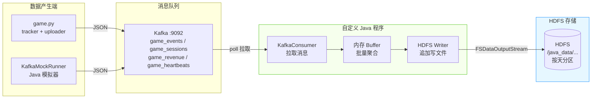
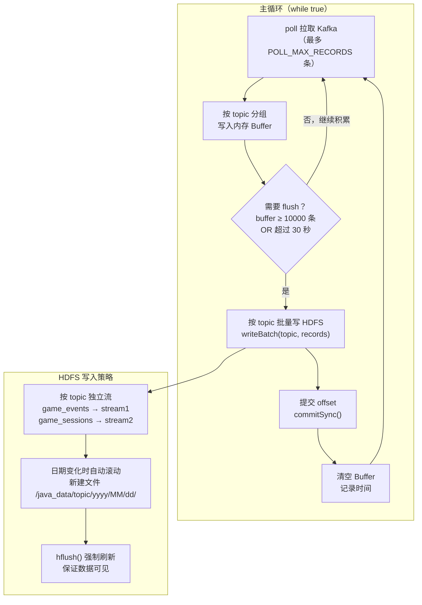

> **环境**：Kafka 2.11-2.1.0 · Hadoop 2.7.6 · JDK 1.8 · Maven 3.x
>
> **目标**：不依赖任何第三方框架，使用 `kafka-clients` 原生消费者 + `hadoop-client` HDFS API，Java 代码实现将 Kafka 数据写入 HDFS。

---

## 一、整体数据流



---

## 二、Maven 工程搭建

### 2.1 创建 Maven 项目

项目名：`kafka-to-hdfs`，与 `data-admin-mapreduce` 同级目录。

```bash
mvn archetype:generate \
    -DgroupId=com.ruoyi.k2h \
    -DartifactId=kafka-to-hdfs \
    -DarchetypeArtifactId=maven-archetype-quickstart \
    -DinteractiveMode=false
```

### 2.2 pom.xml

```xml
<?xml version="1.0" encoding="UTF-8"?>
<project xmlns="http://maven.apache.org/POM/4.0.0"
         xmlns:xsi="http://www.w3.org/2001/XMLSchema-instance"
         xsi:schemaLocation="http://maven.apache.org/POM/4.0.0
         http://maven.apache.org/xsd/maven-4.0.0.xsd">
    <modelVersion>4.0.0</modelVersion>

    <groupId>com.ruoyi.k2h</groupId>
    <artifactId>kafka-to-hdfs</artifactId>
    <version>1.0.0</version>
    <packaging>jar</packaging>
    <name>Kafka to HDFS — Custom Java Consumer</name>

    <properties>
        <java.version>1.8</java.version>
        <maven.compiler.source>1.8</maven.compiler.source>
        <maven.compiler.target>1.8</maven.compiler.target>
        <project.build.sourceEncoding>UTF-8</project.build.sourceEncoding>
    </properties>

    <dependencies>

        <!-- ===== Kafka 原生客户端 ===== -->
        <dependency>
            <groupId>org.apache.kafka</groupId>
            <artifactId>kafka-clients</artifactId>
            <!-- 与 kafka_2.11-2.1.0 对应 -->
            <version>2.1.0</version>
        </dependency>

        <!-- ===== Hadoop HDFS 客户端 ===== -->
        <dependency>
            <groupId>org.apache.hadoop</groupId>
            <artifactId>hadoop-client</artifactId>
            <version>2.7.6</version>
            <!-- 排除 slf4j 避免日志冲突 -->
            <exclusions>
                <exclusion>
                    <groupId>org.slf4j</groupId>
                    <artifactId>slf4j-log4j12</artifactId>
                </exclusion>
                <exclusion>
                    <groupId>log4j</groupId>
                    <artifactId>log4j</artifactId>
                </exclusion>
            </exclusions>
        </dependency>

        <!-- ===== JSON 解析 ===== -->
        <dependency>
            <groupId>com.google.code.gson</groupId>
            <artifactId>gson</artifactId>
            <version>2.8.9</version>
        </dependency>

        <!-- ===== 日志 ===== -->
        <dependency>
            <groupId>org.slf4j</groupId>
            <artifactId>slf4j-simple</artifactId>
            <version>1.7.36</version>
        </dependency>

    </dependencies>

    <build>
        <plugins>
            <!-- 打包成含依赖的 fat jar -->
            <plugin>
                <groupId>org.apache.maven.plugins</groupId>
                <artifactId>maven-assembly-plugin</artifactId>
                <version>3.3.0</version>
                <configuration>
                    <archive>
                        <manifest>
                            <mainClass>com.ruoyi.k2h.runner.KafkaToHdfsRunner</mainClass>
                        </manifest>
                    </archive>
                    <descriptorRefs>
                        <descriptorRef>jar-with-dependencies</descriptorRef>
                    </descriptorRefs>
                </configuration>
                <executions>
                    <execution>
                        <id>make-assembly</id>
                        <phase>package</phase>
                        <goals><goal>single</goal></goals>
                    </execution>
                </executions>
            </plugin>
        </plugins>
    </build>
</project>
```

---

## 三、项目目录结构

```
kafka-to-hdfs/
└── src/main/java/com/ruoyi/k2h/
    ├── config/
    │   └── AppConfig.java          ← 集中管理所有配置项（Kafka/HDFS地址等）
    ├── consumer/
    │   └── GameKafkaConsumer.java  ← Kafka Consumer 封装（拉取 + 手动提交 offset）
    ├── writer/
    │   └── HdfsWriter.java         ← HDFS 写入封装（按天分区、批量追加）
    ├── model/
    │   └── ConsumeRecord.java      ← 消费记录 POJO（topic + partition + offset + value）
    └── runner/
        └── KafkaToHdfsRunner.java  ← 主启动类，多线程调度
```

---

## 四、核心代码实现

### 4.1 AppConfig.java — 配置项集中管理

```java
package com.ruoyi.k2h.config;

/**
 * 集中管理所有配置项。
 * 生产环境建议改为读取外部 properties 文件。
 */
public class AppConfig {

    // ===== Kafka 配置 =====
    /** Kafka Broker 地址 */
    public static String KAFKA_BOOTSTRAP_SERVERS = "172.30.206.104:9092";

    /** Consumer Group ID（同一应用保持一致，保证断点续传） */
    public static final String CONSUMER_GROUP = "java-k2h-group";

    /** 要消费的 Topic 列表 */
    public static final String[] TOPICS = {
        "game_events", "game_sessions", "game_revenue", "game_heartbeats"
    };

    /** 每次 poll 最大拉取条数 */
    public static final int POLL_MAX_RECORDS = 500;

    /** poll 超时时间（毫秒） */
    public static final long POLL_TIMEOUT_MS = 2000L;

    /** 积累多少条记录后批量写 HDFS（小文件优化） */
    public static final int FLUSH_BATCH_SIZE = 10000;

    /** 距上次写入超过多少毫秒后强制 flush（即使不满 batchSize） */
    public static final long FLUSH_INTERVAL_MS = 30_000L;

    // ===== HDFS 配置 =====
    /** HDFS NameNode 地址（替换为实际 IP 或主机名） */
    public static String HDFS_URI = "hdfs://192.168.1.100:9000";

    /** HDFS 根目录，程序会在下面按 topic/年/月/日 自动建子目录 */
    public static final String HDFS_BASE_PATH = "/java_data";
}
```

---

### 4.2 ConsumeRecord.java

```java
package com.ruoyi.k2h.model;

/**
 * 封装从 Kafka 消费到的一条记录。
 */
public class ConsumeRecord {

    /** 来源 Topic 名称（用于决定写哪个 HDFS 目录） */
    private final String topic;

    /** Kafka 分区号 */
    private final int partition;

    /** 消息在分区内的偏移量 */
    private final long offset;

    /** 消息体（JSON 字符串） */
    private final String value;

    public ConsumeRecord(String topic, int partition, long offset, String value) {
        this.topic = topic;
        this.partition = partition;
        this.offset = offset;
        this.value = value;
    }

    public String getTopic()     { return topic; }
    public int getPartition()    { return partition; }
    public long getOffset()      { return offset; }
    public String getValue()     { return value; }

    @Override
    public String toString() {
        return String.format("[%s-%d@%d] %s", topic, partition, offset, value);
    }
}
```

---

### 4.3 HdfsWriter.java — HDFS 写入

```java
package com.ruoyi.k2h.writer;

import com.ruoyi.k2h.config.AppConfig;
import org.apache.hadoop.conf.Configuration;
import org.apache.hadoop.fs.FSDataOutputStream;
import org.apache.hadoop.fs.FileSystem;
import org.apache.hadoop.fs.Path;
import org.slf4j.Logger;
import org.slf4j.LoggerFactory;

import java.io.IOException;
import java.net.URI;
import java.nio.charset.StandardCharsets;
import java.text.SimpleDateFormat;
import java.util.Date;
import java.util.List;
import java.util.Map;
import java.util.concurrent.ConcurrentHashMap;

/**
 * HDFS 写入工具类。
 *
 * 按 topic/年/月/日 自动分目录，追加写入，支持多 topic 并发写。
 *
 * HDFS 路径格式：
 *   /java_data/{topic}/{yyyy}/{MM}/{dd}/data-{timestamp}.log
 */
public class HdfsWriter implements AutoCloseable {

    private static final Logger log = LoggerFactory.getLogger(HdfsWriter.class);

    private final FileSystem fs;

    // 每个 topic 对应一个输出流（追加写入，避免频繁创建文件）
    private final Map<String, FSDataOutputStream> streamMap = new ConcurrentHashMap<>();
    // 每个 topic 当前文件对应的日期（日期变化时滚动新文件）
    private final Map<String, String> dateMap = new ConcurrentHashMap<>();

    private final SimpleDateFormat sdf = new SimpleDateFormat("yyyy/MM/dd");
    private final SimpleDateFormat dateSdf = new SimpleDateFormat("yyyyMMdd");

    public HdfsWriter() throws IOException {
        // 初始化 HDFS 客户端
        Configuration conf = new Configuration();
        conf.set("fs.defaultFS", AppConfig.HDFS_URI);
        // 关键：以超级用户身份操作，避免权限问题（教学环境）
        System.setProperty("HADOOP_USER_NAME", "root");
        this.fs = FileSystem.get(URI.create(AppConfig.HDFS_URI), conf);
        log.info("HDFS 连接成功: {}", AppConfig.HDFS_URI);
    }

    /**
     * 批量写入一批消息到 HDFS。
     *
     * @param topic   Kafka Topic 名称（对应 HDFS 子目录）
     * @param records 消息内容列表（每条是一行 JSON 字符串）
     */
    public synchronized void writeBatch(String topic, List<String> records) throws IOException {
        if (records == null || records.isEmpty()) return;

        String today = dateSdf.format(new Date());
        String currentDate = dateMap.get(topic);

        // 日期变化或流未创建时，新建文件（滚动）
        if (!today.equals(currentDate)) {
            closeStream(topic);
            FSDataOutputStream out = openNewFile(topic);
            streamMap.put(topic, out);
            dateMap.put(topic, today);
            log.info("为 topic={} 创建新 HDFS 文件，日期={}", topic, today);
        }

        FSDataOutputStream out = streamMap.get(topic);

        // 追加写入，每条记录一行
        for (String record : records) {
            byte[] bytes = (record + "\n").getBytes(StandardCharsets.UTF_8);
            out.write(bytes);
        }
        // 强制刷新，保证数据落盘
        out.hflush();

        log.info("写入 HDFS topic={} 共 {} 条", topic, records.size());
    }

    /**
     * 在 HDFS 上创建新文件（按 topic/日期/时间戳 命名）。
     */
    private FSDataOutputStream openNewFile(String topic) throws IOException {
        String datePath = sdf.format(new Date());
        String dirPath = AppConfig.HDFS_BASE_PATH + "/" + topic + "/" + datePath;
        Path dir = new Path(dirPath);

        // 目录不存在则创建
        if (!fs.exists(dir)) {
            fs.mkdirs(dir);
        }

        // 文件名含时间戳，避免重复
        String fileName = topic + "-" + System.currentTimeMillis() + ".log";
        Path filePath = new Path(dirPath + "/" + fileName);

        log.info("创建 HDFS 文件: {}", filePath);
        return fs.create(filePath, false);
    }

    /**
     * 关闭指定 topic 的输出流。
     */
    private void closeStream(String topic) {
        FSDataOutputStream out = streamMap.remove(topic);
        if (out != null) {
            try {
                out.close();
                log.info("关闭 HDFS 流: topic={}", topic);
            } catch (IOException e) {
                log.warn("关闭流失败: topic={}", topic, e);
            }
        }
    }

    /**
     * 关闭所有流（程序退出时调用）。
     */
    @Override
    public void close() {
        streamMap.keySet().forEach(this::closeStream);
        try {
            fs.close();
            log.info("HDFS FileSystem 已关闭");
        } catch (IOException e) {
            log.warn("关闭 FileSystem 失败", e);
        }
    }
}
```

---

### 4.4 GameKafkaConsumer.java — Kafka 消费者

```java
package com.ruoyi.k2h.consumer;

import com.ruoyi.k2h.config.AppConfig;
import com.ruoyi.k2h.model.ConsumeRecord;
import org.apache.kafka.clients.consumer.ConsumerConfig;
import org.apache.kafka.clients.consumer.ConsumerRecord;
import org.apache.kafka.clients.consumer.ConsumerRecords;
import org.apache.kafka.clients.consumer.KafkaConsumer;
import org.apache.kafka.common.serialization.StringDeserializer;
import org.slf4j.Logger;
import org.slf4j.LoggerFactory;

import java.time.Duration;
import java.util.ArrayList;
import java.util.Arrays;
import java.util.List;
import java.util.Properties;

/**
 * 封装 Kafka Consumer 的拉取逻辑。
 *
 * 特性：
 * 1. 订阅多个 Topic（game_events / game_sessions / game_revenue / game_heartbeats）
 * 2. 手动提交 offset（at-least-once 语义，写完 HDFS 再提交）
 * 3. 每次 poll 返回封装好的 ConsumeRecord 列表，由上层决定何时写 HDFS
 */
public class GameKafkaConsumer implements AutoCloseable {

    private static final Logger log = LoggerFactory.getLogger(GameKafkaConsumer.class);

    private final KafkaConsumer<String, String> consumer;

    public GameKafkaConsumer() {
        Properties props = new Properties();

        // Broker 地址
        props.put(ConsumerConfig.BOOTSTRAP_SERVERS_CONFIG, AppConfig.KAFKA_BOOTSTRAP_SERVERS);

        // Consumer Group（保证断点续传：重启后从上次提交的 offset 继续）
        props.put(ConsumerConfig.GROUP_ID_CONFIG, AppConfig.CONSUMER_GROUP);

        // Key / Value 反序列化器（消息体是 JSON 字符串）
        props.put(ConsumerConfig.KEY_DESERIALIZER_CLASS_CONFIG,   StringDeserializer.class.getName());
        props.put(ConsumerConfig.VALUE_DESERIALIZER_CLASS_CONFIG, StringDeserializer.class.getName());

        // 关闭自动提交（手动控制，确保写入 HDFS 成功后再提交 offset）
        props.put(ConsumerConfig.ENABLE_AUTO_COMMIT_CONFIG, "false");

        // 每次 poll 最大拉取条数
        props.put(ConsumerConfig.MAX_POLL_RECORDS_CONFIG, AppConfig.POLL_MAX_RECORDS);

        // 首次消费从最早的消息开始（earliest），已有提交 offset 则从上次继续
        props.put(ConsumerConfig.AUTO_OFFSET_RESET_CONFIG, "earliest");

        this.consumer = new KafkaConsumer<>(props);

        // 订阅所有业务 Topic
        consumer.subscribe(Arrays.asList(AppConfig.TOPICS));
        log.info("已订阅 Topics: {}", Arrays.toString(AppConfig.TOPICS));
    }

    /**
     * 拉取一批消息。
     *
     * @return 消费记录列表（可能为空）
     */
    public List<ConsumeRecord> poll() {
        List<ConsumeRecord> result = new ArrayList<>();

        // 阻塞等待，最多 POLL_TIMEOUT_MS 毫秒
        ConsumerRecords<String, String> records =
            consumer.poll(Duration.ofMillis(AppConfig.POLL_TIMEOUT_MS));

        for (ConsumerRecord<String, String> record : records) {
            result.add(new ConsumeRecord(
                record.topic(),
                record.partition(),
                record.offset(),
                record.value()
            ));
        }

        return result;
    }

    /**
     * 手动同步提交 offset。
     * 在确认数据写入 HDFS 后调用，保证 at-least-once 语义。
     */
    public void commitSync() {
        consumer.commitSync();
    }

    @Override
    public void close() {
        consumer.close();
        log.info("Kafka Consumer 已关闭");
    }
}
```

---

### 4.5 KafkaToHdfsRunner.java — 主启动类

```java
package com.ruoyi.k2h.runner;

import com.ruoyi.k2h.config.AppConfig;
import com.ruoyi.k2h.consumer.GameKafkaConsumer;
import com.ruoyi.k2h.model.ConsumeRecord;
import com.ruoyi.k2h.writer.HdfsWriter;
import org.slf4j.Logger;
import org.slf4j.LoggerFactory;

import java.util.ArrayList;
import java.util.HashMap;
import java.util.List;
import java.util.Map;

/**
 * 主启动类。
 *
 * 核心流程：
 *   1. 创建 KafkaConsumer，订阅 4 个 Topic
 *   2. 循环 poll，按 topic 分组积累消息
 *   3. 满足 flushBatchSize 或 flushInterval 时，批量写 HDFS
 *   4. 写成功后手动 commitSync，保证 at-least-once
 *   5. JVM ShutdownHook 保证正常退出时关闭资源
 *
 * 用法：
 *   java -jar kafka-to-hdfs-1.0.0-jar-with-dependencies.jar [kafka地址] [hdfs地址]
 *   java -jar kafka-to-hdfs-1.0.0-jar-with-dependencies.jar 172.30.206.104:9092 hdfs://192.168.1.100:9000
 */
public class KafkaToHdfsRunner {

    private static final Logger log = LoggerFactory.getLogger(KafkaToHdfsRunner.class);

    public static void main(String[] args) throws Exception {

        // ===== 解析命令行参数 =====
        if (args.length >= 1) {
            AppConfig.KAFKA_BOOTSTRAP_SERVERS = args[0];
            log.info("Kafka 地址 = {}", args[0]);
        }
        if (args.length >= 2) {
            AppConfig.HDFS_URI = args[1];
            log.info("HDFS 地址 = {}", args[1]);
        }

        // ===== 初始化组件 =====
        GameKafkaConsumer consumer = new GameKafkaConsumer();
        HdfsWriter writer = new HdfsWriter();

        // 注册 ShutdownHook，确保 Ctrl+C 时正常关闭资源
        Runtime.getRuntime().addShutdownHook(new Thread(() -> {
            log.info("收到关闭信号，正在清理资源...");
            consumer.close();
            writer.close();
            log.info("资源已释放，程序退出");
        }));

        // ===== 主循环 =====
        // 按 topic 分组的本地 Buffer（避免频繁小文件写入）
        Map<String, List<String>> buffer = new HashMap<>();
        // 上次 flush 时间
        long lastFlushTime = System.currentTimeMillis();
        // 总消费计数
        long totalConsumed = 0;

        log.info("开始消费 Kafka，写入 HDFS...");

        while (true) {
            // 1. 拉取消息
            List<ConsumeRecord> records = consumer.poll();
            totalConsumed += records.size();

            // 2. 按 topic 分组写入 buffer
            for (ConsumeRecord r : records) {
                buffer.computeIfAbsent(r.getTopic(), k -> new ArrayList<>())
                      .add(r.getValue());
            }

            // 3. 判断是否需要 flush
            long now = System.currentTimeMillis();
            int bufferTotal = buffer.values().stream().mapToInt(List::size).sum();
            boolean shouldFlush =
                bufferTotal >= AppConfig.FLUSH_BATCH_SIZE ||
                (now - lastFlushTime) >= AppConfig.FLUSH_INTERVAL_MS;

            if (shouldFlush && bufferTotal > 0) {
                // 4. 批量写 HDFS
                for (Map.Entry<String, List<String>> entry : buffer.entrySet()) {
                    writer.writeBatch(entry.getKey(), entry.getValue());
                }
                buffer.clear();

                // 5. 写成功后提交 offset（at-least-once）
                consumer.commitSync();

                lastFlushTime = now;
                log.info("flush 完成，本次写入 {} 条，累计消费 {} 条", bufferTotal, totalConsumed);
            }
        }
    }
}
```

---

## 五、程序工作原理



---

## 六、打包与运行

### 6.1 打包

```bash
cd kafka-to-hdfs
mvn clean package -DskipTests
# 生成 target/kafka-to-hdfs-1.0.0-jar-with-dependencies.jar
```

### 6.2 运行

```bash
# 方式一：使用默认配置（AppConfig 中的 IP）
java -jar target/kafka-to-hdfs-1.0.0-jar-with-dependencies.jar

# 方式二：命令行指定 Kafka 地址和 HDFS 地址
java -jar target/kafka-to-hdfs-1.0.0-jar-with-dependencies.jar \
    172.30.206.104:9092 \
    hdfs://192.168.1.100:9000

# 后台运行（生产环境）
nohup java -jar target/kafka-to-hdfs-1.0.0-jar-with-dependencies.jar \
    172.30.206.104:9092 \
    hdfs://192.168.1.100:9000 \
    > logs/k2h.log 2>&1 &

# 实时查看日志
tail -f logs/k2h.log
```

### 6.3 停止

```bash
# 发送 SIGTERM，触发 ShutdownHook 正常退出
kill $(ps aux | grep kafka-to-hdfs | grep -v grep | awk '{print $2}')
```

---

## 七、验证 HDFS 落地数据

### 7.1 查看目录结构

```bash
# 查看根目录
hadoop fs -ls /java_data/

# 查看 game_events 当天数据
hadoop fs -ls /java_data/game_events/2026/06/29/

# 查看文件内容（每行一条 JSON）
hadoop fs -cat /java_data/game_events/2026/06/29/game_events-1719640000000.log | head -5
```

期望输出：
```json
{"event_id":"e-001","player_id":"p-001","event_type":"level_start","level_id":1,"score":0,"timestamp":1719640000}
{"event_id":"e-002","player_id":"p-002","event_type":"level_pass","level_id":1,"score":350,"timestamp":1719640001}
...
```

### 7.2 HDFS 落地目录结构

```
/java_data/
├── game_events/
│   └── 2026/06/29/
│       ├── game_events-1719640000000.log   ← 第一个文件（满 10000 条或超 30s 后创建新文件）
│       └── game_events-1719643600000.log
├── game_sessions/
│   └── 2026/06/29/
│       └── game_sessions-1719640000000.log
├── game_revenue/
│   └── 2026/06/29/
│       └── game_revenue-1719640000000.log
└── game_heartbeats/
    └── 2026/06/29/
        └── game_heartbeats-1719640000000.log
```

---

## 八、关键参数调优

| 参数 | 默认值 | 说明 | 调优建议 |
|------|--------|------|---------|
| `FLUSH_BATCH_SIZE` | 10000 | 积累多少条后写 HDFS | 数据量小时调低（如 1000）；大吞吐时调高 |
| `FLUSH_INTERVAL_MS` | 30000 | 最长等待时间（毫秒） | 实时性要求高可调到 5000 |
| `POLL_MAX_RECORDS` | 500 | 每次 poll 最大拉取条数 | 消费落后时可调高到 2000 |
| `POLL_TIMEOUT_MS` | 2000 | poll 阻塞超时 | 一般无需修改 |

---

## 九、常见问题

| 问题 | 原因 | 解决方案 |
|------|------|---------|
| `No FileSystem for scheme hdfs://` | Hadoop 相关 jar 未加入 classpath | 检查 pom.xml hadoop-client 版本是否与集群一致 |
| `Connection refused: NameNode` | HDFS 地址配置错误 | 检查 `AppConfig.HDFS_URI` 是否可 ping 通 |
| `Permission denied` | HDFS 路径没有写权限 | 设置 `HADOOP_USER_NAME=root` 或赋权 `hadoop fs -chmod 777 /java_data` |
| `offset commit failed` | Kafka Broker 超时 | 增大 `session.timeout.ms` 配置（在 Consumer Properties 中） |
| 数据重复 | 程序崩溃后 offset 未提交，重启后重新消费 | at-least-once 正常行为，HDFS 文件追加写，MapReduce 去重处理 |
| 文件小 | flushBatchSize 太低 | 调大 `FLUSH_BATCH_SIZE` 到 50000 以上 |

---

## 知识点小结

| 知识点 | 说明 |
|--------|------|
| `KafkaConsumer.poll()` | 核心 API，阻塞拉取消息，返回 `ConsumerRecords` |
| 手动提交 offset | `enable.auto.commit=false` + `commitSync()`，写 HDFS 成功后再提交，保证不丢数 |
| at-least-once 语义 | 先写 HDFS 再提交 offset。崩溃时可能重复写，但不会丢失数据 |
| `FSDataOutputStream` | Hadoop HDFS 写入流，`hflush()` 刷入 DataNode 内存，`close()` 正式落盘 |
| Consumer Group | 同 group 的多个消费者共享分区，实现并行消费；相同 group.id 重启后断点续传 |
| Buffer + 定时 flush | 避免每条消息创建一个 HDFS 文件（HDFS 不适合小文件），核心优化手段 |
| ShutdownHook | `Runtime.getRuntime().addShutdownHook(...)` 注册 JVM 退出钩子，Ctrl+C 时优雅关闭 |
